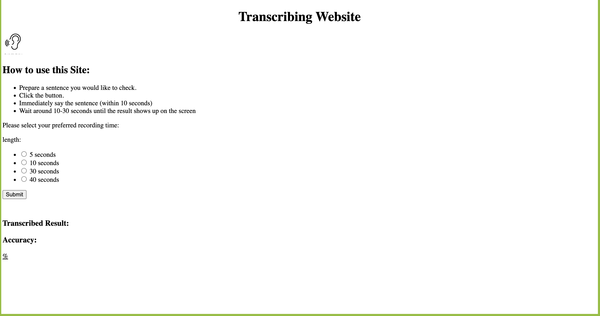

# grammar
**STT Grammar (Speech to Text Grammar)**
_STT Grammar is a program that corrects the grammar of an audio transcript through a specific website. It uses django for the domain of the website and an external Google application to help write down the audio text._ 

The initial plan goes like below:
1. Create a Virtual Environment :white_check_mark:
2. Use django to create a website domain :white_check_mark:
3. Use Google Application Credentials to make a transcript of an audio file :white_check_mark:
4. Use chatGPT to correct the grammar of the transcript written down

_However, only until the first three steps has been achieved. Additional changes will be made to the program._


**1. Creating Python Virtual Environment**
- Create virtual environment & activate it (.env) 
- Install all the packages in "requirments.txt" by inserting the code below 
    ```python
    pip install -r requirements.txt
    ```
    - Use django, a framework for building websites
    - Send requests - for sending an http api request to server (provide a programmatical way to access server)
    - Speechrecognition - send stt request to google


**2. Prerequisite**
- You need GOOGLE_APPLICATION_CREDENTIALS from google api website.


**3. Running the website** 
- Use the code below to run the website.
    ```python
    python manage.py runserver 
    ```

Once done, you can access the website on localhost:8000
The image below is a sample output of the website:

